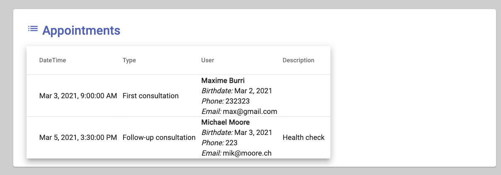
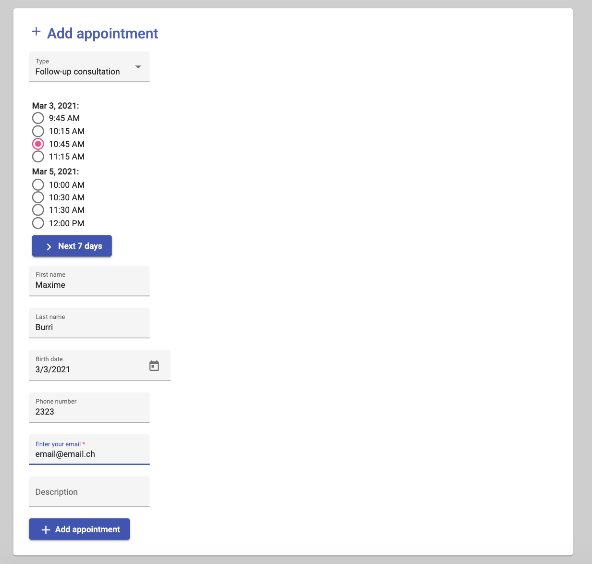

# Simple Appointment Booking Application
A basic appointment booking web application with Scala (akka-http) and Angular, an exercice mainly developed in 11 hours.

## Features
A user can:
- list appointments
- book an appointment on a free slots




## Run

### Install and the run back-end
Install JRE, sbt and scala (tested with sbt 1.4.7, Java 15.0.1 and Scala 2.13.5)

In the `back-end` folder execute:
```
sbt run
```


### Install and run the front-end
Install npm and install globally ng-cli (`npm install -g @angular/cli`)

In then `front-end` folder execute:
```
npm install
ng serve
```

Lastly enjoy in a browser to http://localhost:4200/ !

## Todo
- config files and environment variables (e.g. port and urls)
- docker files / CI build
- integration tests
- more checks of form values in back-end
- more logging
- improve error handling in communication front-end/back-end
- user management
- ...


